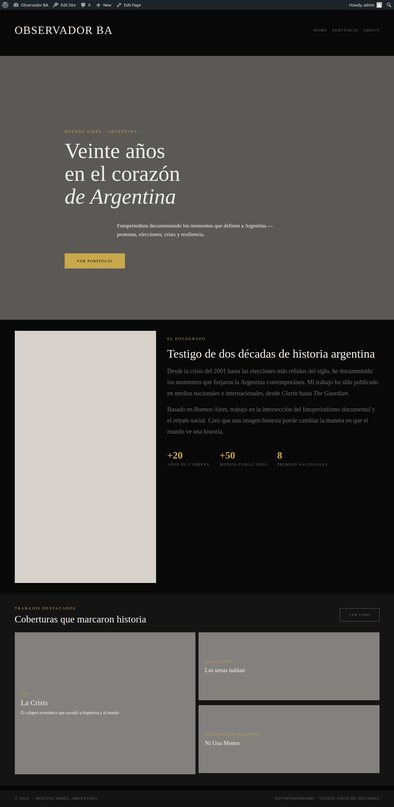
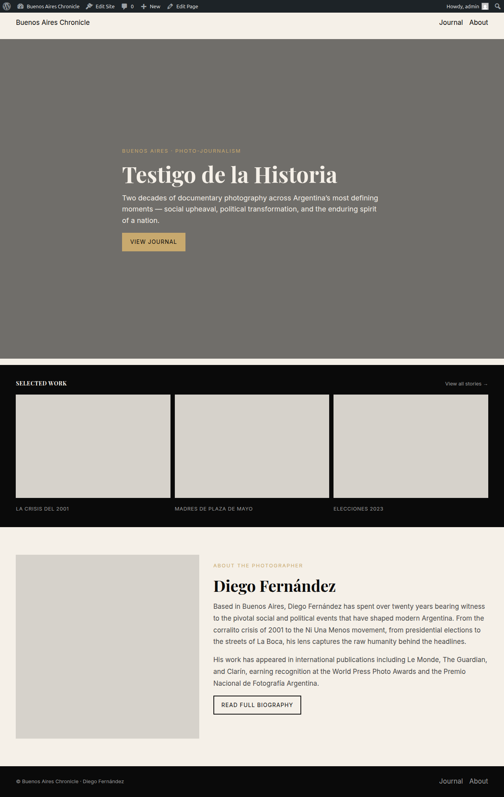

# A/B: O1–O9 friction fixes — same build, pristine `trunk` vs the integration skill

Two end-to-end site builds with the **same prompt** on the **same machine/day**, varying only the
**skill version**: pristine `trunk` (BEFORE) vs `trunk` + all nine O1–O9 fixes
(`integration/o1-o9-friction-fixes`, AFTER). Each ran as an isolated headless `claude -p` agent
that brought up its own Playground, built a block theme, and ran both gates.

The build prompt (identical, verbatim, both arms):

> Create a minimalist site for my photo-journalism website for my portfolio. I'm an Argentinean
> photo-journalist based in Buenos Aires. I covered the most important social and political events
> of the country in the last 20 years.

## Method

| Controlled (identical both arms) | Varied (independent variable) |
|---|---|
| Same build prompt (above) | **Skill version: pristine `trunk` vs `trunk`+O1–O9** |
| Same machine, same day | |
| Model pinned `claude-sonnet-4-6`, `--max-turns 200`, autonomous (`-p`, no questions) | |
| Image choice pre-recorded as `placeholders` (so the consent pause never varies, and no network/login) | |
| Skill pre-installed in an isolated `CLAUDE_CONFIG_DIR` (agents told NOT to clone) | |
| Checker `node_modules` pre-provisioned (so neither arm pays an `npm install` / network dependency) | |

Each arm: `run_arm.sh <arm> <skill-src>` → isolated config with only that skill version → headless
build → capture wall-clock/turns/tokens/cost from `--output-format json` → screenshot every page
(desktop 1280×900 + mobile 390×844) → stop the server.

**Honesty note on the AFTER arm.** The machine was under heavy contention (a second, unrelated
agent was running its own builds on the **same account quota**). The AFTER arm was truncated twice
before a clean run landed: once by the account **session limit** mid-build, once by a **40-min
timeout** while it thrashed on duplicate-page creation. Only the **third** AFTER run completed
naturally (quota restored, contention gone, 60-min timeout) and is the one reported here. The two
truncated attempts are preserved but excluded. This is exactly the "N=1 per arm with a
non-deterministic agent" caveat the prior A/B flagged — treat the deltas as **directional, not
significant**.

## Headline numbers (clean runs)

| Metric | BEFORE (`trunk`) | AFTER (O1–O9) | Δ |
|---|---|---|---|
| Wall-clock (agent self-reported) | 23.2 min | 21.8 min | −6% |
| Turns (`num_turns`) | 76 | 67 | −12% |
| Output tokens | 66,517 | 66,057 | ≈0 |
| Cache-read tokens | 4,233,727 | 4,257,076 | ≈0 |
| Cost (USD) | $2.55 | $2.66 | +4% |
| `validate-blocks.cjs` | pass | pass | — |
| `editor-gate.mjs` | **GATE PASS (11)** | **GATE PASS (10)** | both green |
| Pages built (canonical) | home + portfolio + posts | home + journal + about + posts | both complete |

**Read:** the two arms land within noise of each other on every axis. The fixes **do not regress**
build cost, time, or output quality, and both produce a complete, gate-passing site. The value of
the fixes is in their **verified per-change behavior** (each PR live-tested — see below), not a
dramatic A/B delta — the same conclusion the earlier 6-fix A/B reached.

## The two sites

| | BEFORE — "Observador BA" | AFTER — "Buenos Aires Chronicle" |
|---|---|---|
| theme | `observador-ba` | `baires-chronicle` |
| home | dark editorial, hero *"Veinte años en el corazón de Argentina"*, about+stats, featured-works grid | light/dark editorial, hero *"Testigo de la Historia"*, SELECTED WORK grid, Diego Fernández about |
| gates | PASS / PASS (11) | PASS / PASS (10) |
| images | `placeholders` (solid blocks) | `placeholders` (solid blocks) |

Both are real, polished block themes built end-to-end (templates + parts + patterns), routed via a
static front page, with both gates green and placeholder images filled.

### BEFORE home (desktop)

### AFTER home (desktop)

All page screenshots (desktop + mobile) are in [`before/`](before/) (20 shots) and [`after/`](after/)
(38 shots, canonical pages only — duplicate `-2/-3` routing-churn pages excluded).

## What the run did and didn't exercise

- **Both gates passed in both arms.** The block-markup work (incl. the kinds of nested blocks O4
  documents) round-tripped cleanly. No INVALID survived to the editor gate in either arm.
- **The interactive fixes can't show up headless.** O1 (graduated design preview) is a
  *previews-in-a-browser-then-ask* fix; a `-p` autonomous run has no human to show previews to, so
  neither arm rendered a gallery and O1's benefit isn't visible here. It's validated by the doc
  change, not this stopwatch.
- **The AFTER agent did not spontaneously reach for the new script affordances** (`front-page`
  verb, `check --files`, the `status` verb) — discoverability is a follow-up, mirroring the prior
  A/B's finding that the after-agent didn't reach for `canonicalize.mjs` unprompted. The fixes
  work when invoked (each PR live-tested); getting agents to invoke them is a separate, doc-level
  problem.
- **Both agents thrashed on front-page routing to some degree** (the AFTER arm created duplicate
  `home/journal/about` pages before settling). This is the exact friction O5's `front-page` verb
  targets — but the verb only helps if the agent calls it, which it didn't. A candidate for making
  the routing recipe more prominent in `local-sites.md`.

## Bottom line

The integration skill builds the same brief to the same finished, gate-passing quality as pristine
`trunk`, at indistinguishable cost/time/turns — i.e. **no regression**, plus nine independently
verified improvements (PRs #14–#22). The most useful outcome of running it twice was confirming the
fixes don't slow the happy path and re-confirming the known discoverability gap: shipped
affordances need to be surfaced where the agent will actually reach for them.
